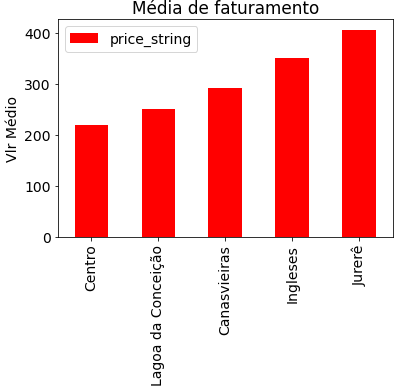
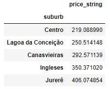
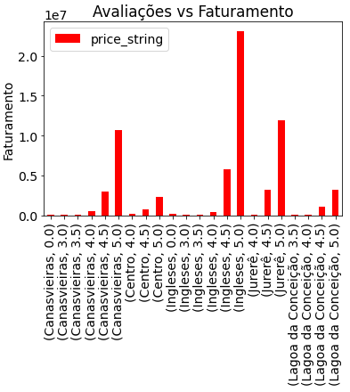

# Properties_Occupation
Analisar dados de ocupação e preço de anúncios no Airbnb

# Índice
- Solicitações
- Objetivos
- Tipos de Análise
- Analisando com Python
- Preparação do Banco de Dados (SQL Server)

# Solicitações
Foi solicitado uma análise de dados de ocupação e preço de anúncios no Airbnb

# Objetivos
Como objetivo, foi proposto ordenar os dados e responder algumas perguntas:
- 1º)  Ordene os bairros em ordem crescente de número de listings
- 2º)  Ordene os bairros em ordem crescente de faturamento médio dos listings
- 3º)  Existem correlações entre as características de um anúncio e seu faturamento?
      a. Quais? Explique
- 4º)  Qual a antecedência média das reservas?
      a. Esse número é maior ou menor para finais de semana?     

# Tipos de Análise
- 1º Método:  Análise com Python, Gráficos com Python
- 2º Método:  Análise com SQL Server, Gráficos com PowerBI

# Analisando com Python
Foram disponibilizados dois arquivos .csv para as análises.
- desafio_details.csv (4.691 registros)
- desafio_priceav.csv (354.520 registros)
- O Período analisado está entre 02/11/2020 e 30/03/2021
- Foram utilizadas as seguintes bibliotecas:
    - Pandas
    - Numpy
    - Matplotlib
    - Datetime
 - Foram efetuados comandos para:
    -  Agrupar, Somar, Contar, Ordenar e Média dos registros (groupby, sum, count, sort_values, mean)
    -  Criar e editar gráficos (plot, xlabel, title, etc...)
    -  Alterar tipos de dados e trocar dados nulos (astype, str.replace) 
    -  Filtrar Dados (loc)
    -  Criar colunas calculadas (operador matemático de menos)
    -  Extrair datas dos dias da semana (dt.day_name)
    -  Extrair números inteiros de coluna timedelta64 (dt.days)
    -  Ordenar dados com comando categorias do pandas (pd.Categorical)

# Análise dos Dados e Observações
> ## Primeira Solicitação
Dados agrupados por bairro (suburb), e ordenados por número do anúncio (listing)

> ## Segunda Solicitação
Dados agrupados por bairro (suburb), e ordenados pelo faturamento médio (price_string), do menor para o maior valor

Obs: Neste gráfico podemos observar que o bairro Jurerê tem o maior faturamento médio no período

   
  

  

   
  

  
> ## Terceira Solicitação
Dados agrupados por bairro (suburb) e por avaliações (star_rating), somando o valor de faturamento.

Obs: Neste gráfico podemos observar que quanto melhor a avaliação do imóvel, maior é o faturamento total.

Considerando que quanto melhor é a avaliação, maior é o faturamento com locações, podemos afirmar que existe relação direta com as características do imóvel.

      
 

